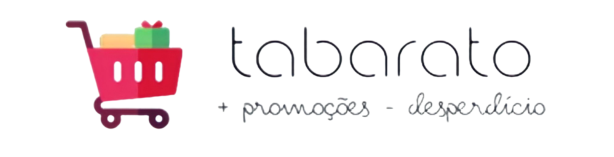
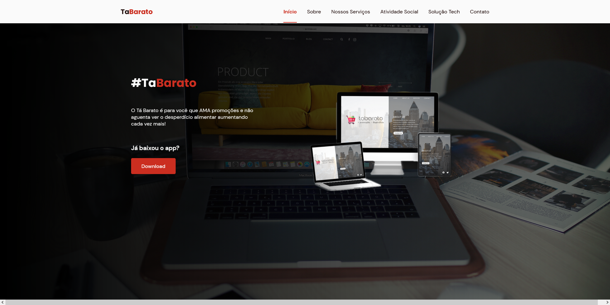
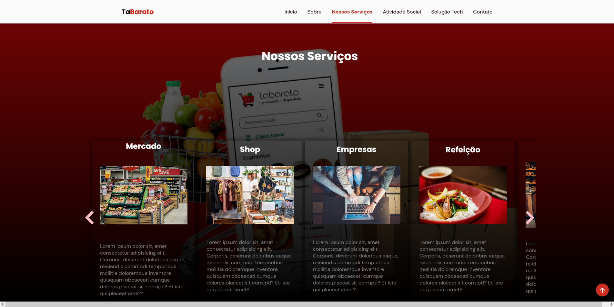
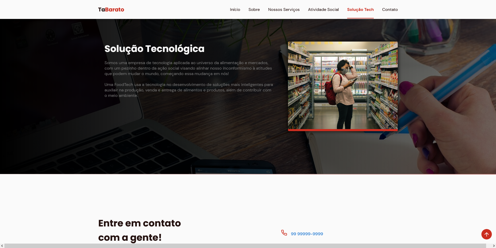

# 💻 Landing Page TaBarato

O TáBarato surgiu da necessidade que temos ao realizarmos as compras 
do mês e compras avulsas durante os dias da semana. Fazer a tal da pesquisa 
de preço é algo penoso demandando tempo e gasto com transporte, com isso 
acabamos escolhendo o mercado "mais barato" para fazer as compras que precisamos. 

Assim surgiu o TáBarato, com a missão de facilitar a pesquisa de preços de produtos
alimentícios à eletroeletrônicos.

Ah! O TáBarato também possui sua Missão Social! 

Nossa missão social é reduzir o desperdício alimentar e auxiliar ONG's na batalha 
por uma sociedade mais justa e igualitária. Por este motivo, temos uma seção exclusiva 
para conexão com ONG's de cada região do país, onde você pode se conectar diretamente 
com elas para realizar uma doação ou se tornar um agente voluntário, 
seja você pessoa física ou empresa.

## 💻 Tech Stack:
  

## 📷 Screenshots

Home

Nossos Serviços

Solução Tecnológica

## 📝 Autores

- [Clara Freitas](https://github.com/claraff22)
- [Kervin ES](https://github.com/kervines)
- [Francisco Netto](https://www.github.com/fsousanetto)
- [Bruno Augusto](https://github.com/BrunoAugustods)
- Jonathan Francelino
- Mille Amorin
- Bruno Silva

## 💻 Desenvolvedores

- [Clara Freitas](https://github.com/claraff22)
- [Kervin ES](https://github.com/kervines)
- [Francisco Netto](https://www.github.com/fsousanetto)
